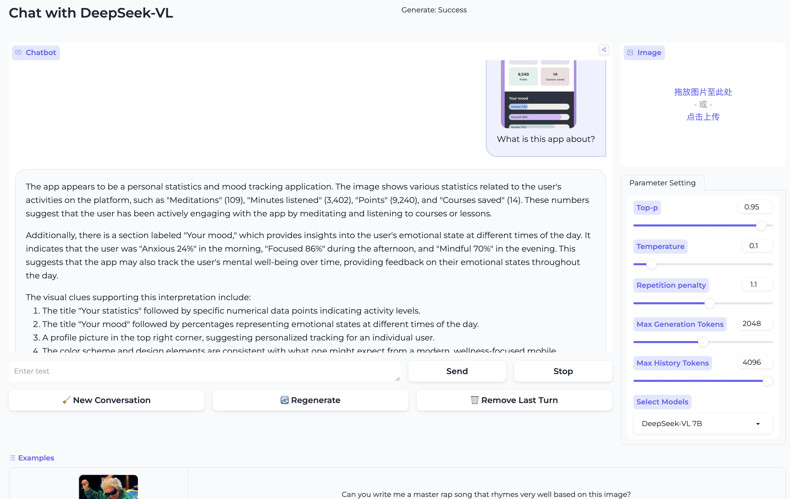

<!-- markdownlint-disable first-line-h1 -->
<!-- markdownlint-disable html -->
<!-- markdownlint-disable no-duplicate-header -->

<div align="center">
  
</div>
<hr>
<div align="center">

  <a href="https://www.deepseek.com/" target="_blank">
    
  </a>
  <a href="https://huggingface.co/spaces/deepseek-ai/DeepSeek-VL-7B" target="_blank">
    
  </a>
  <a href="https://huggingface.co/deepseek-ai" target="_blank">
    
  </a>

</div>


<div align="center">

  <a href="https://discord.gg/Tc7c45Zzu5" target="_blank">
    
  </a>
  <a href="images/qr.jpeg" target="_blank">
    
  </a>
  <a href="https://twitter.com/deepseek_ai" target="_blank">
    
  </a>

</div>

<div align="center">

  <a href="LICENSE-CODE">
    
  </a>
  <a href="LICENSE-MODEL">
    
  </a>
</div>


<p align="center">
  <a href="#3-model-downloads"><b>📥 Model Download</b></a> |
  <a href="#4-quick-start"><b>⚡ Quick Start</b></a> |
  <a href="#5-license"><b>📜 License</b></a> |
  <a href="#6-citation"><b>📖 Citation</b></a> <br>
  <a href="https://arxiv.org/abs/2403.05525"><b>📄 Paper Link</b></a> |
  <a href="https://huggingface.co/papers/2403.05525"><b>🤗 Huggingface Paper Link</b></a> |
  <a href="https://huggingface.co/spaces/deepseek-ai/DeepSeek-VL-7B"><b>👁️ Demo</b></a>
</p>


## 1. Introduction

Introducing DeepSeek-VL, an open-source Vision-Language (VL) Model designed for real-world vision and language understanding applications. DeepSeek-VL possesses general multimodal understanding capabilities, capable of processing logical diagrams, web pages, formula recognition, scientific literature, natural images, and embodied intelligence in complex scenarios.

[DeepSeek-VL: Towards Real-World Vision-Language Understanding](https://arxiv.org/abs/2403.05525)

Haoyu Lu*, Wen Liu*, Bo Zhang**, Bingxuan Wang, Kai Dong, Bo Liu, Jingxiang Sun, Tongzheng Ren, Zhuoshu Li, Hao Yang, Yaofeng Sun, Chengqi Deng, Hanwei Xu, Zhenda Xie, Chong Ruan (*Equal Contribution, **Project Lead)


## 2. Release

<details>
<summary>✅ <b>2024-03-14</b>: Demo for DeepSeek-VL-7B available on <a href="https://huggingface.co/spaces/deepseek-ai/DeepSeek-VL-7B">Hugging Face</a>.</summary>
<br>Check out the gradio demo of DeepSeek-VL-7B at <a href="https://huggingface.co/spaces/deepseek-ai/DeepSeek-VL-7B">https://huggingface.co/spaces/deepseek-ai/DeepSeek-VL-7B</a>. Experience its capabilities firsthand!
</details>


<details>
<summary>✅ <b>2024-03-13</b>: Support DeepSeek-VL gradio demo.

</details>

<details>
<summary>✅ <b>2024-03-11</b>: DeepSeek-VL family released, including <code>DeepSeek-VL-7B-base</code>, <code>DeepSeek-VL-7B-chat</code>, <code>DeepSeek-VL-1.3B-base</code>, and <code>DeepSeek-VL-1.3B-chat</code>.</summary>
<br>The release includes a diverse set of models tailored for various applications within the DeepSeek-VL family. The models come in two sizes: 7B and 1.3B parameters, each offering base and chat variants to cater to different needs and integration scenarios.

</details>

## 3. Model Downloads

We release the DeepSeek-VL family, including 1.3B-base, 1.3B-chat, 7b-base and 7b-chat models, to the public.
To support a broader and more diverse range of research within both academic and commercial communities.
Please note that the use of this model is subject to the terms outlined in [License section](#5-license). Commercial usage is
permitted under these terms.

### Huggingface

| Model                 | Sequence Length | Download                                                                    |
|-----------------------|-----------------|-----------------------------------------------------------------------------|
| DeepSeek-VL-1.3B-base | 4096            | [🤗 Hugging Face](https://huggingface.co/deepseek-ai/deepseek-vl-1.3b-base) |
| DeepSeek-VL-1.3B-chat | 4096            | [🤗 Hugging Face](https://huggingface.co/deepseek-ai/deepseek-vl-1.3b-chat) |
| DeepSeek-VL-7B-base   | 4096            | [🤗 Hugging Face](https://huggingface.co/deepseek-ai/deepseek-vl-7b-base)   |
| DeepSeek-VL-7B-chat   | 4096            | [🤗 Hugging Face](https://huggingface.co/deepseek-ai/deepseek-vl-7b-chat)   |


## 4. Quick Start

### Installation

On the basis of `Python >= 3.8` environment, install the necessary dependencies by running the following command:

```shell
pip install -e .
```

### Simple Inference Example

```python
import torch
from transformers import AutoModelForCausalLM

from deepseek_vl.models import VLChatProcessor, MultiModalityCausalLM
from deepseek_vl.utils.io import load_pil_images


# specify the path to the model
model_path = "deepseek-ai/deepseek-vl-7b-chat"
vl_chat_processor: VLChatProcessor = VLChatProcessor.from_pretrained(model_path)
tokenizer = vl_chat_processor.tokenizer

vl_gpt: MultiModalityCausalLM = AutoModelForCausalLM.from_pretrained(model_path, trust_remote_code=True)
vl_gpt = vl_gpt.to(torch.bfloat16).cuda().eval()

## single image conversation example
conversation = [
    {
        "role": "User",
        "content": "<image_placeholder>Describe each stage of this image.",
        "images": ["./images/training_pipelines.jpg"],
    },
    {"role": "Assistant", "content": ""},
]

## multiple images (or in-context learning) conversation example
# conversation = [
#     {
#         "role": "User",
#         "content": "<image_placeholder>A dog wearing nothing in the foreground, "
#                    "<image_placeholder>a dog wearing a santa hat, "
#                    "<image_placeholder>a dog wearing a wizard outfit, and "
#                    "<image_placeholder>what's the dog wearing?",
#         "images": [
#             "images/dog_a.png",
#             "images/dog_b.png",
#             "images/dog_c.png",
#             "images/dog_d.png",
#         ],
#     },
#     {"role": "Assistant", "content": ""}
# ]

# load images and prepare for inputs
pil_images = load_pil_images(conversation)
prepare_inputs = vl_chat_processor(
    conversations=conversation,
    images=pil_images,
    force_batchify=True
).to(vl_gpt.device)

# run image encoder to get the image embeddings
inputs_embeds = vl_gpt.prepare_inputs_embeds(**prepare_inputs)

# run the model to get the response
outputs = vl_gpt.language_model.generate(
    inputs_embeds=inputs_embeds,
    attention_mask=prepare_inputs.attention_mask,
    pad_token_id=tokenizer.eos_token_id,
    bos_token_id=tokenizer.bos_token_id,
    eos_token_id=tokenizer.eos_token_id,
    max_new_tokens=512,
    do_sample=False,
    use_cache=True
)

answer = tokenizer.decode(outputs[0].cpu().tolist(), skip_special_tokens=True)
print(f"{prepare_inputs['sft_format'][0]}", answer)
```

### CLI Chat
```bash
python cli_chat.py --model_path "deepseek-ai/deepseek-vl-7b-chat"

# or local path
python cli_chat.py --model_path "local model path"
```

### Gradio Demo
```bash
pip install -e .[gradio]

python deepseek_vl/serve/app_deepseek.py
```


Have Fun!

## 5. License

This code repository is licensed under [the MIT License](https://github.com/deepseek-ai/DeepSeek-LLM/blob/HEAD/LICENSE-CODE). The use of DeepSeek-VL Base/Chat models is subject to [DeepSeek Model License](https://github.com/deepseek-ai/DeepSeek-LLM/blob/HEAD/LICENSE-MODEL). DeepSeek-VL series (including Base and Chat) supports commercial use.

## 6. Citation

```
@misc{lu2024deepseekvl,
      title={DeepSeek-VL: Towards Real-World Vision-Language Understanding},
      author={Haoyu Lu and Wen Liu and Bo Zhang and Bingxuan Wang and Kai Dong and Bo Liu and Jingxiang Sun and Tongzheng Ren and Zhuoshu Li and Hao Yang and Yaofeng Sun and Chengqi Deng and Hanwei Xu and Zhenda Xie and Chong Ruan},
      year={2024},
      eprint={2403.05525},
      archivePrefix={arXiv},
      primaryClass={cs.AI}
}
```

## 7. Contact

If you have any questions, please raise an issue or contact us at [service@deepseek.com](mailto:service@deepseek.com).
